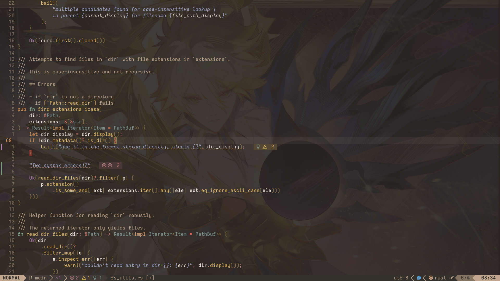

# neovim-config

My [Neovim](https://github.com/neovim/neovim) config that I try
to keep this quite minimal. If you want to use this, simply clone
this repository into your config path (usually `~/.config/nvim/`).

Loosely based off of [kickstart.nvim](https://github.com/nvim-lua/kickstart.nvim).

# Setup

Some general info about my config:

- Pretty opinionated, I'd say
- Uses the native [`vim.pack`](https://neovim.io/doc/user/pack/#_plugin-manager) plugin manager
- Intended for the latest nightly Neovim release
  - Enables [UI2](https://neovim.io/doc/user/lua/#_ui2) for a better experience with `cmdheight=0`
  - Plugins are loaded faster with [`vim.loader`](https://neovim.io/doc/user/lua/#vim.loader)
- Targets writing in Rust, C++, C, Lua and Bash

## Modules

- `colorschemes`: a bunch of colorschemes I like
- `lsp-setup`: sets up certain plugins for LSP support
- `neovide`: specific options for Neovide
- `unconfigured-plugins`: plugins that solely use defaults

## Plugins

This list excludes any colorschemes.

- `blink.cmp`: completions
- `conform`: formatting
- `cord`: discord status
- `dial.nvim`: extended \<C-a\>/\<C-x\>
- `gitsigns.nvim`: hunks
- `lualine`: pretty statusline
- `mini.surround`: for surround commands
- `nvim-autopairs`: pairs stuff
- `nvim-treesitter-endwise`: endwise rules
- `nvim-treesitter`: treesitter is treesitter
- `rustaceanvim`: rust integrations
- `tiny-glimmer.nvim`: operator animations
- `tiny-inline-diagnostic.nvim`: prettier diagnostics
- `todo-comments.nvim`: highlighted failures
- `vim-fugitive`: git integrations

# Showcase

Neovide, 20% transparency, custom Iosevka build, Cipher from hit game
_Honkers Railway_ ([creds](https://www.pixiv.net/en/artworks/128665632)).

